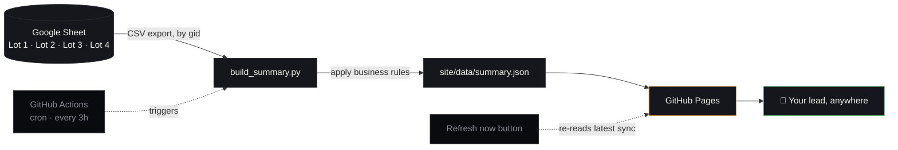

<div align="center">



### Live, self-updating status of the As-Built ISO comment register — across **4 lots**, by reviewer, by severity.

[](https://github.com/vikramdex-ops/iso-review-dashboard/actions/workflows/deploy.yml)
[](https://vikramdex-ops.github.io/iso-review-dashboard/)


**[→ Open the live dashboard](https://vikramdex-ops.github.io/iso-review-dashboard/)**

</div>

<br>

## What this is

A single static page that always shows the current state of the ISO review register — who owns what, how much is closed, open, or on hold, split by severity and by lot, with a combined cross-lot view per reviewer. No one touches the Google Sheet export manually, no one re-runs a script, no one pushes code to refresh it. A scheduled job does that every 3 hours, and a **Refresh now** button on the page does it on demand.

The sheet stays the single source of truth. This repo only mirrors it, honestly, into something a lead can glance at.

<br>

## How it stays current



Every run is guarded, not best-effort:

- **Fetched by numeric tab `gid` only** — never by sheet name, which Google silently substitutes with the wrong tab on a mismatch.
- **Content-hash checked across lots** — if two lots ever fetch byte-identical CSV, the run fails loudly instead of quietly duplicating a lot.
- **All-or-nothing per sync** — if any lot can't be read, the previous deployed site is left untouched rather than publishing partial numbers.
- **The sync itself is committed back to the repo** (`site/data/summary.json`, `closed_log.json`) — every number on the dashboard is auditable against real git history, not a black box.

<br>

## The rules behind the numbers

Everything the dashboard shows is derived mechanically from the sheet — no manual tagging.

| Rule | Logic |
|---|---|
| **Who owns a comment** | Column **P** (`Assigned To`). If two names appear separated by `/`, the **later** name is the actual assignee. |
| **Severity** | Column **M** (`Severity`) — High / Medium / Low. |
| **Closed / Completed** | Column **N** (`Status`) = `Closed`, **or** column **Q** (`Modeller response`) contains *updated, completed, done, ignored,* etc. — even while Status still reads Open. |
| **On Hold** | Column **Q** contains `RDB` or `HOLD`. |
| **Open** | Anything not matched above. |
| **Completed Today / Yesterday** | A persisted first-seen-closed log timestamps each row the moment it's first observed closed (IST calendar day), so "today's" closures are exact — not a quirk of when the sheet happened to update. |

<br>

## On the dashboard

- **Overview strip** — total assigned, closed, open, on hold, at a glance before anything else.
- **Per-lot breakdown** — Lot 1 · Lot 2 · Lot 3 · Lot 4, filterable by chip, each row keyed by reviewer.
- **Combined (by person)** — the same reviewer's numbers rolled up across *all four lots* in one line, for when lot boundaries don't matter and ownership does.
- **Severity ledger** — proportional High / Medium / Low bars per person.
- **Refresh now** — pulls the latest committed sync on demand, no redeploy required.
- **Sheet reconciliation line** — states plainly how many rows were read vs. counted vs. excluded, so a mismatch is visible, not hidden.

<details>
<summary><b>Full column set (19 columns per row)</b></summary>

<br>

`Assigned To` · `Lot Category` · `Assigned/Closed/Open — High` · `Assigned/Closed/Open — Medium` · `Assigned/Closed/Open — Low` · `Hold — High/Medium/Low` · `Overall Total Assigned` · `Overall Closed` · `Overall Open` · `Completed Today` · `Completed Yesterday`

</details>

<br>

## Project layout

```
iso-review-dashboard/
├── config.json                  # sheet id, lot → gid map, status keywords
├── scripts/
│   └── build_summary.py         # fetch → apply rules → write summary.json
├── site/
│   ├── index.html                # the dashboard itself (single file, no build step)
│   └── data/
│       ├── summary.json          # latest synced snapshot (committed every run)
│       └── closed_log.json       # per-row first-closed date, for day-aware counts
└── .github/workflows/deploy.yml  # cron (3h) + manual dispatch → sync → commit → deploy
```

## Adding another lot

Add one entry to `config.json` — the tab's numeric `gid`, same sheet:

```json
"lots": { "Lot 5": "123456789" }
```

Nothing else changes. The combined view, the chips, and the totals strip all pick it up on the next sync.

<br>

<div align="center">

Built with Python, GitHub Actions, and GitHub Pages — no server, no database, no vendor lock-in.

</div>
