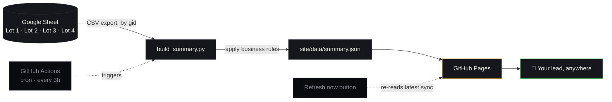

<div align="center">


<br>

[](https://github.com/vikramdex-ops/iso-review-dashboard/actions/workflows/deploy.yml)
[](https://vikramdex-ops.github.io/iso-review-dashboard/)


[](LICENSE)
[](https://github.com/vikramdex-ops/iso-review-dashboard/stargazers)
[](CONTRIBUTING.md)

<br>

### 🔗 [**Open the live dashboard →**](https://vikramdex-ops.github.io/iso-review-dashboard/)

<sub>`vikramdex-ops.github.io/iso-review-dashboard` — bookmark it, no login needed</sub>

</div>

<br>

<p align="center">
  <a href="#what-this-is">What this is</a> ·
  <a href="#how-it-stays-current">How it stays current</a> ·
  <a href="#the-rules-behind-the-numbers">The rules behind the numbers</a> ·
  <a href="#on-the-dashboard">On the dashboard</a> ·
  <a href="#project-layout">Project layout</a> ·
  <a href="#adding-another-lot">Adding a lot</a> ·
  <a href="#faq">FAQ</a>
</p>


<br>

## What this is

A single static page that always shows the current state of the ISO review register — who owns what, how much is closed, open, or on hold, split by severity and by lot, with a combined cross-lot view per reviewer. No one touches the Google Sheet export manually, no one re-runs a script, no one pushes code to refresh it. A scheduled job does that every 3 hours, and a **Refresh now** button on the page does it on demand.

The sheet stays the single source of truth. This repo only mirrors it, honestly, into something a lead can glance at.

<table align="center">
<tr>
<td align="center" width="25%">

**📋 4 Lots**
<br><sub>Lot 1 – Lot 4, same rules</sub>

</td>
<td align="center" width="25%">

**⏱ Every 3 hours**
<br><sub>cron-driven, no manual trigger</sub>

</td>
<td align="center" width="25%">

**🧮 Zero guesswork**
<br><sub>rules applied mechanically</sub>

</td>
<td align="center" width="25%">

**🪵 Fully auditable**
<br><sub>every sync is a git commit</sub>

</td>
</tr>
</table>

<br>

## Who this is for

The rules in this repo are specific to one ISO review register, but the shape of the problem isn't: **"I have a Google Sheet someone updates, and I need a live status page for people who shouldn't need sheet access."** Status trackers, intake logs, review registers, punch lists — anything where the sheet is the real database and a dashboard is just the window into it.

If that's your situation, the parts worth taking are:

- a sync script that reads tabs by numeric `gid` (not name — Google silently swaps tabs on a name mismatch, see [`build_summary.py`](scripts/build_summary.py))
- a content-hash guard against accidentally reading the same tab twice
- an all-or-nothing sync so a bad fetch never overwrites a good dashboard
- a GitHub Actions workflow that does the fetch → commit → deploy loop on a schedule, for free, with no server

Swap the column mapping and keyword rules for your own sheet's shape (see [Adding another lot](#adding-another-lot) and [`CONTRIBUTING.md`](CONTRIBUTING.md)) and the rest holds.

<br>

## How it stays current



Every run is guarded, not best-effort:

- **Fetched by numeric tab `gid` only** — never by sheet name, which Google silently substitutes with the wrong tab on a mismatch.
- **Content-hash checked across lots** — if two lots ever fetch byte-identical CSV, the run fails loudly instead of quietly duplicating a lot.
- **All-or-nothing per sync** — if any lot can't be read, the previous deployed site is left untouched rather than publishing partial numbers.
- **The sync itself is committed back to the repo** (`site/data/summary.json`, `closed_log.json`) — every number on the dashboard is auditable against real git history, not a black box.

<br>

## The rules behind the numbers

Everything the dashboard shows is derived mechanically from the sheet — no manual tagging.

| Rule | Logic |
|---|---|
| **Who owns a comment** | Column **P** (`Assigned To`). If two names appear separated by `/`, the **later** name is the actual assignee. |
| **Severity** | Column **M** (`Severity`) — High / Medium / Low. |
| **Closed / Completed** | Column **N** (`Status`) = `Closed`, **or** column **Q** (`Modeller response`) contains *updated, completed, done, ignored,* etc. — even while Status still reads Open. |
| **On Hold** | Column **Q** contains `RDB` or `HOLD`. |
| **Open** | Anything not matched above. |
| **Completed Today / Yesterday** | A persisted first-seen-closed log timestamps each row the moment it's first observed closed (IST calendar day), so "today's" closures are exact — not a quirk of when the sheet happened to update. |

<br>

## On the dashboard

- **Overview strip** — total assigned, closed, open, on hold, at a glance before anything else.
- **Per-lot breakdown** — Lot 1 · Lot 2 · Lot 3 · Lot 4, filterable by chip, each row keyed by reviewer.
- **Combined (by person)** — the same reviewer's numbers rolled up across *all four lots* in one line, for when lot boundaries don't matter and ownership does.
- **Severity ledger** — proportional High / Medium / Low bars per person.
- **Refresh now** — pulls the latest committed sync on demand, no redeploy required.
- **Sheet reconciliation line** — states plainly how many rows were read vs. counted vs. excluded, so a mismatch is visible, not hidden.

<details>
<summary><b>Full column set (19 columns per row)</b></summary>

<br>

`Assigned To` · `Lot Category` · `Assigned/Closed/Open — High` · `Assigned/Closed/Open — Medium` · `Assigned/Closed/Open — Low` · `Hold — High/Medium/Low` · `Overall Total Assigned` · `Overall Closed` · `Overall Open` · `Completed Today` · `Completed Yesterday`

</details>

<br>

## Project layout

```
iso-review-dashboard/
├── config.json                  # sheet id, lot → gid map, status keywords
├── scripts/
│   └── build_summary.py         # fetch → apply rules → write summary.json
├── site/
│   ├── index.html                # the dashboard itself (single file, no build step)
│   └── data/
│       ├── summary.json          # latest synced snapshot (committed every run)
│       └── closed_log.json       # per-row first-closed date, for day-aware counts
└── .github/workflows/deploy.yml  # cron (3h) + manual dispatch → sync → commit → deploy
```

## Adding another lot

Add one entry to `config.json` — the tab's numeric `gid`, same sheet:

```json
"lots": { "Lot 5": "123456789" }
```

Nothing else changes. The combined view, the chips, and the totals strip all pick it up on the next sync.

<br>

## FAQ

<details>
<summary><b>Does this need a backend, database, or paid hosting?</b></summary>
<br>No. The sync runs in GitHub Actions (free for public repos), the output is one JSON file, and the page is static HTML served by GitHub Pages (also free). The only moving part is the Google Sheet itself.
</details>

<details>
<summary><b>Does Claude / this repo have write access to my Google Sheet?</b></summary>
<br>No — it only reads the published CSV export of each tab (the sheet must be shared "Anyone with the link → Viewer"). Nothing is ever written back to the sheet.
</details>

<details>
<summary><b>What if the sheet structure doesn't match mine?</b></summary>
<br>Edit the column mapping and keyword lists in <code>config.json</code> / <code>scripts/build_summary.py</code> — see <a href="#who-this-is-for">Who this is for</a> and <a href="CONTRIBUTING.md">CONTRIBUTING.md</a>. Nothing else in the pipeline needs to change.
</details>

<details>
<summary><b>Can I self-host this for my own team?</b></summary>
<br>Yes — it's MIT licensed. Fork it, point <code>config.json</code> at your own sheet, and GitHub Actions + Pages do the rest on your own repo.
</details>

<br>

## Built with

<p align="center">
  
  
  
  
  
</p>

<div align="center">
<sub>No server. No database. No vendor lock-in. The sheet stays the source of truth — this is just the window into it.</sub>
</div>

<br>

## Star history

<a href="https://star-history.com/#vikramdex-ops/iso-review-dashboard&Date">
  <picture>
    <source media="(prefers-color-scheme: dark)" srcset="https://api.star-history.com/svg?repos=vikramdex-ops/iso-review-dashboard&type=Date&theme=dark" />
    
  </picture>
</a>

<div align="center">

If the sheet-to-dashboard pattern here saves you from building your own, a ⭐ helps the next person find it.

<br><br>


</div>
